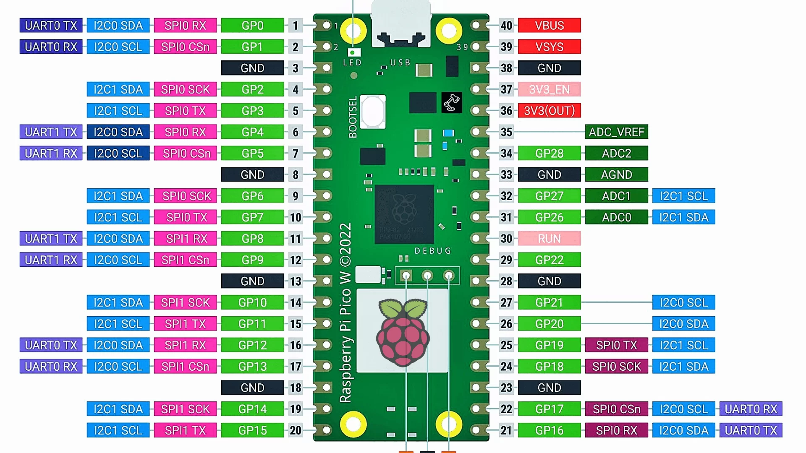
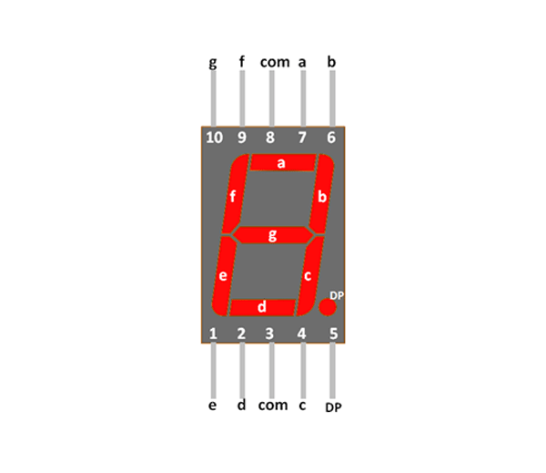

# uPython

## Introduction

A MicroPython library for controlling electronic devices on the Raspberry Pi Pico (and any other MicroPython-compatible board).



---

## Modules

Reusable drivers for individual hardware components.

- [LED](#led)
- [Seven Segment Display (SSD 5011BS)](#seven-segment-display-ssd-5011bs)
- [OLED Display (I2C)](#oled-display-i2c)
- [OLED Display (SPI)](#oled-display-spi)
- [Water Sensor](#water-sensor)
- [WiFi — ESP-07 (ESP8266)](#wifi--esp-07-esp8266)

## Samples

Complete project examples built on top of the modules above.

- [Tabbie — Animated Desk Companion](#tabbie--animated-desk-companion)

---

## LED

Controls a single LED with on/off and blink capabilities.

**Default pin:** GP25 (built-in LED on Raspberry Pi Pico)

```python
from upython.LED import LED

led = LED(pin_number=25)

led.turn_on()
led.turn_off()

# Blink once (blocks for 2 × interval seconds)
led.blink(interval=1)

# Blink indefinitely using a hardware timer (non-blocking)
led.blink_indefinitely(interval=500)  # interval in ms
```

---

## Seven Segment Display (SSD 5011BS)

Controls a 7-segment display (5011BS) with individual segment pins.



### Wiring

| Pico pin | Segment |
|----------|---------|
| GP19     | a       |
| GP18     | b       |
| GP12     | c       |
| GP15     | d       |
| GP14     | e       |
| GP16     | f       |
| GP17     | g       |
| GP13     | dot     |

> Connect the common pin to **GND** for common-cathode or to **3.3V** for common-anode displays. Common-anode displays also require current-limiting resistors on each segment pin.

### Usage

```python
import time
from upython.SevenSegmentDisplay import SSD_5011BS

display = SSD_5011BS(common_cathode=True)  # set False for common-anode

# Display digits 0–9
for i in range(10):
    display.set_number(i)
    time.sleep(1)

# Turn on the decimal point
display.set_decimal_point(True)

# Print current segment state to REPL
display.get_state()
```


---

## OLED Display (I2C)

Controls an SSD1306-based OLED display over I2C.

**Default pins:** SDA → GP0, SCL → GP1

```python
from upython.OledDisplay import OledDisplay

oled = OledDisplay(sda=0, scl=1, width=128, height=64)

# Write a single line of text
oled.write_text("Hello!", x=0, y=0)

# Write multiple lines
oled.write_lines(["Line 1", "Line 2", "Line 3"], start_y=0, line_spacing=10)

# Set a single pixel
oled.set_pixel(64, 32, color=1)

# Invert display colors
oled.invert(True)

# Clear the display
oled.clear()
```

---

## OLED Display (SPI)

Controls an SSD1306-based OLED display over SPI.

**Default pins:** SCK → GP2, SDA/MOSI → GP3, RES → GP4, DC → GP5, CS → GP6

```python
from upython.OledDisplay import SpiOledDisplay

oled = SpiOledDisplay(sck=2, sda=3, res=4, dc=5, cs=6, width=128, height=64)

oled.write_text("Hello SPI!", x=0, y=0)
oled.write_lines(["Temp: 25C", "Humidity: 60%"])
oled.invert(True)
oled.clear()
```

---

## Water Sensor

Reads analog values from a water/moisture sensor.

**Default pin:** GP26 (ADC0)

```python
from upython.WaterSensor import WaterSensor

sensor = WaterSensor(pin_number=26)

# Returns a 16-bit value (0–65535). Higher = more water detected.
value = sensor.read()
print(value)
```

---

## WiFi — ESP-07 (ESP8266)

Drives an ESP-07 (ESP8266) WiFi module via AT commands over UART.

### Wiring

| Pico       | ESP-07 | Description          |
|------------|--------|----------------------|
| GP8 (TX1)  | RX     | Pico → ESP data      |
| GP9 (RX1)  | TX     | ESP → Pico data      |
| 3V3        | VCC    | Power                |
| GND        | GND    | Ground               |

> UART1 is used by default to avoid conflicts with the REPL on UART0.

### Usage

```python
from upython.WiFi import ESP07

wifi = ESP07(tx=8, rx=9)

# Connect to a network
wifi.connect("MyNetwork", "password123")

# Check IP address
print(wifi.ip())  # e.g. '192.168.1.42'

# HTTP GET request
response = wifi.get("http://api.example.com/data")
print(response)

# HTTP POST request
wifi.post("http://api.example.com/submit", '{"value": 42}')

# Check connection status
print(wifi.is_connected())  # True / False

# Disconnect
wifi.disconnect()
```

---

## Samples

## Tabbie — Animated Desk Companion

An animated robot face rendered on an SSD1306 SPI OLED display. Tabbie reacts to commands sent over USB serial (REPL).

### Expressions

| Command      | Description                                 |
|--------------|---------------------------------------------|
| `idle`       | Default resting face                        |
| `focus`      | Focused/working expression                  |
| `break_time` | Relaxed/happy expression                    |
| `love`       | Heart eyes (one-shot, 4 s)                  |
| `angry`      | Angry / paused expression                   |
| `complete`   | Excited celebration (one-shot, 5 s)         |
| `paused`     | Alias for `angry`                           |
| `pomodoro <task>` | Enter focus mode and briefly show task name |
| `notify <text>`   | Briefly display a notification message      |
| `status`     | Print current state to serial               |

### Usage

```python
from upython.OledDisplay import SpiOledDisplay
from upython.samples.tabbie import Tabbie

oled = SpiOledDisplay(sck=2, sda=3, res=4, dc=5, cs=6)
tabbie = Tabbie(oled)

# Plays startup animation and enters the main loop
tabbie.start()
```

Once running, send commands over the serial/REPL:

```
focus
pomodoro Deep work session
notify Coffee break!
complete
idle
status
```
