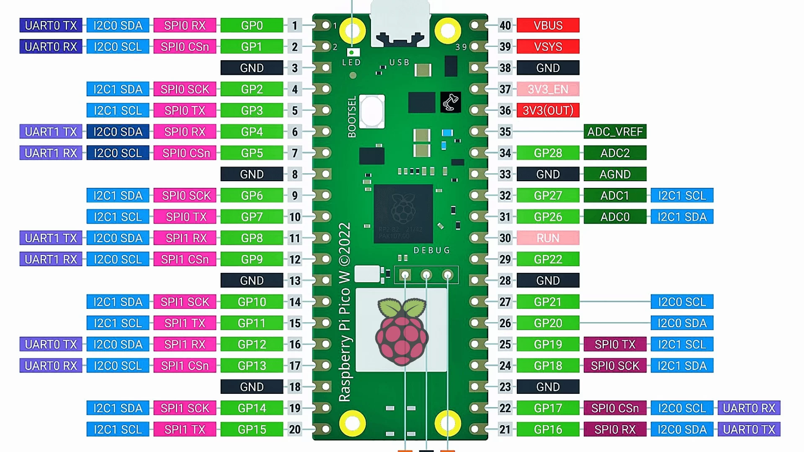

# uPython

## 1. Introduction
This is a project that aims to be a library to control multiple electronic devices using micropython.

## 2. Raspbery Pi Pico
This repository is being developed using the Raspberry Pi Pico, but it should work with any other board that supports micropython.

