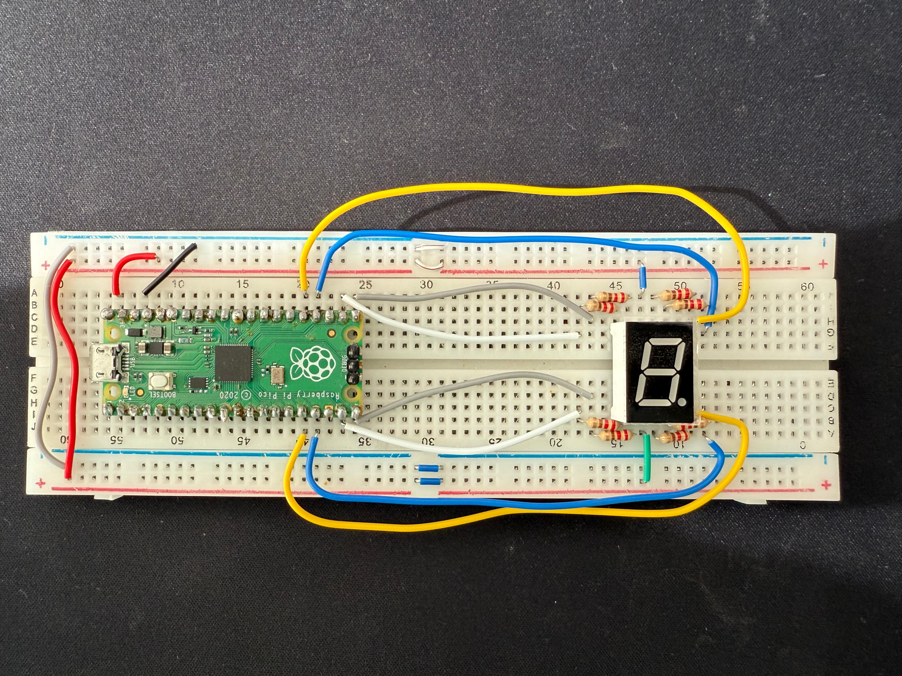

# Seven Segment Display

This module provides classes to control a 7-segment display.

## 5011BS
The 5011BS is a common 7-segment display with a pinout as shown below.


### How to set up the connections
Connect the 5011BS to the Raspberry Pi Pico, connecting each of the pins to the corresponding GPIO pin on the Pico.



You should test if the display is common anode or common cathode. If it is common anode, connect the common pin to 3.3V and if it is common cathode, connect the common pin to GND

    Caution! If your display is common anode, you should connect the common pin to 3.3V and if it is common anode, you will need to place resistors between the GPIO pins and the display pins.

### How to use the module
```python
display = SSD_5011BS(common_cathode=False)


for i in range(10):
    display.set_number(i)
    time.sleep(1)
```
Example code to display numbers from 0 to 9.


